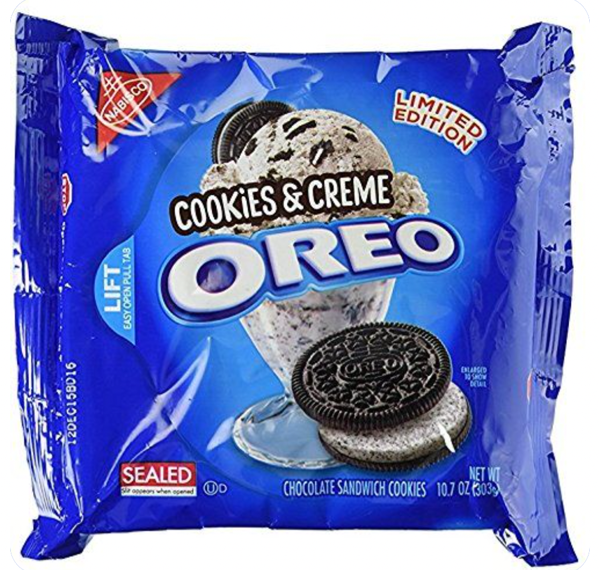



This page lists my favorite examples of recursion. I take *recursion* to mean "having an item of category X inside another item of category X." (This definition is the standard one in linguistics. It differs from the computer science notion of recursion, which refers to having a process call itself, but the concepts are related: Linguistics-style recursion is one potential result of computer-science-style recursion. For discussion of the definition of recursion, see [this page](https://rtmccoy.com/fun/recursion/).

**Cookies & Creme flavored Oreos:** These now-discontinued Oreos contained little bits of Oreo inside their frosting.

